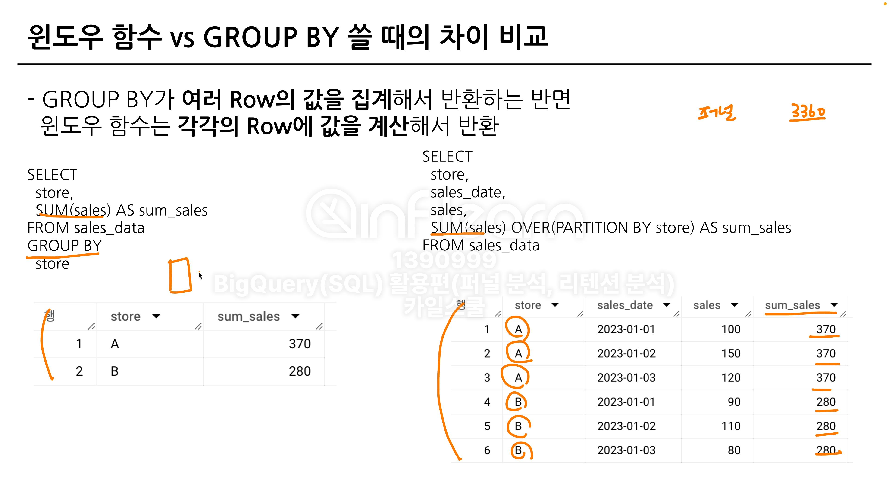

# 번호지정함수
- 번호를 지정하는 함수들

## ROW_NUMBER (행의 순서)
` ROW_NUMBER() OVER (PARTITION BY 컬럼 ORDER BY) ` = 1,2,3

## RANK (순위)
` RANK() OVER (PARTITION BY 컬럼 ORDER BY) ` = 1,1,3
` DENSE_RANK() OVER (PARTITION BY 컬럼 ORDER BY) ` = 1,1,2

## RANK VS ROW_NUMBER = 중복의 처리 방법
- ROW_NUMBER : 동일한 값이 있나면 랜덤으로 1,2등 설정

# 집계 분석 함수
`집계 함수(컬럼[계산 대상]) OVER (PARTITION BY 컬럼[집계 대상])`

- GROUP BY 말고 옆에 새로운 컬럼을 추가하고 싶을 때 사용
- 윈도우 함수는 각각의 ROW에 값을 계산해서 반환함(GROUP BY는 여러 ROW의 값을 집계)

