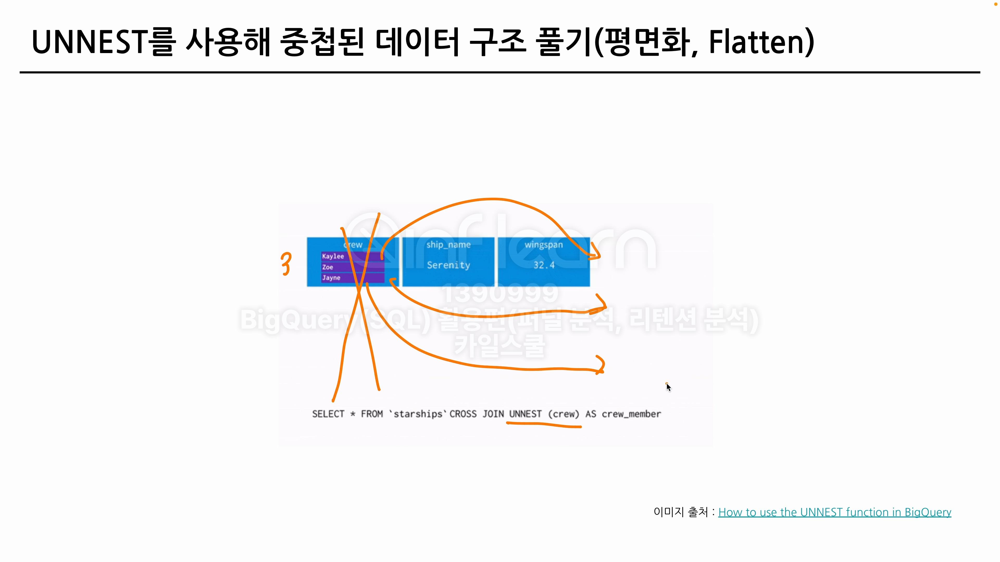

하나의 행에 여러 값이 포함된 경우가 있다 > Array(배열) 사용 필요

# ARRAY(배열)
- 같은 타입의 여러 값을 하나의 컬럼에 저장할 수 있음
- ex) [1,3,5]

## 배열 생성법
1. 대괄호 사용 []
2. ARRAY <> 사용  
    `select ARRAY[0,1,3] as some_numbers`
3. 배열 생성 함수  
    `SELECT GENERATE_DATE_ARRAY('시작년도,'끝년도',INTERVAL 1 WEEKS)`
    `SELECT GENERATE_ARRAY(1,5,2)`

4. ARRAY_AGG 함수 사용 : 여러 결과를 마지막에 배열로 저장하고 싶은 경우

## 배열 접근법
OFFSET : 0부터 시작  
ORDINAL : 1부터 시작

` SELECT 배열컬럼[OFFSET/ORDINAL(숫자)] `

# STRUCT
- 프로그래밍 언어에서 지원하는 자료형 중 하나
- 서로 다른 타입의 여러 값을 하나의 컬럼에 저장 가능
- EX) 사람이라는 STRUCT에 이름, 나이, 정수를 묶어 저장


## ARRAY VS STRUCT
- 같은 속성의 값들을 묶어 저장 
- 다른 속성의 값들을 묶어 저장 EX)주소록, 영화 정보

## STRUCT 생성법
1. 소괄호 사용 ()
2. STRUCT<>() 사용하기 
```
SELECT STRUCT(1 AS ID, APPLE AS FRUIT)
```


`STRUCT<자료형>(데이터)`  
```
SELECT STRUCT<`오늘` DATETIME, `시간` INT64>(DATETIME '2026-01-14 00:00:00',3) AS PT
```
> 여기서 오늘과 시간이 KEY값으로 접근에 사용한다

## STRUCT 접근법
```
SELECT PT.`오늘`
```

# UNNEST 사용하기
- 배열을 직접적으로 접근하는 것 보다 > 독립적인 행으로 풀어서 사용하는 방법
- ARRAY요소를 독립적인 행으로 펼칠 때

## UNNEST 사용법
```
SELECT
  s.id
FROM t
CROSSJOIN UNNEST(arr) AS s

# 이 때 CROSSJOIN을 ,로 생략할 수 있음

SELECT
  s.id
FROM t,
UNNEST(arr) AS s

```


## 팁
### 1
array할 때는 as로 지칭한 명칭 사용   
STRUCT이면 as로 지칭한 명칭.컬럼명

```
# 장르가 array일 때

SELECT title, S
FROM `advanced.array_exercises`, 
UNNEST(genres) as S

# 장르가 STRUCT일 때

SELECT
  title,
  a.actor,
  a.character
FROM `advanced.array_exercises`,
UNNEST(actors) AS a;

```

### 2
array할 때 as로 지칭한 명칭 뒤에 .컬럼명을 붙일 수 있음
```
# S에는 actor와 character가 STRUCT형태로 있었음

SELECT title, S.actor, S.character
FROM `advanced.array_exercises`,
UNNEST(actors) as S
```

### 3
unnest는 2번 이상 사용 가능

### 4
UNNEST 후 조건을 줄 때  
ARRRY<STRUCT> as a=> STRUCT가 됨 > SELECT a.컬럼명    


ARRAY<STRING> as b-> STRING이 됨 > SELECT b

### 5
ARRAY 안에 STRUCT 안에 STRUCT 구조
> STRUCT은 SELECT에서 별칭.으로 하기

> ARRAY → UNNEST  
> STRUCT → SELECT에서 별칭.필드명

### 6
FROM
  → UNNEST
    → WHERE
      → GROUP BY
        → HAVING
          → SELECT
            → ORDER BY
              → LIMIT
