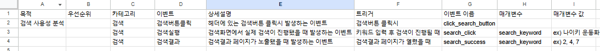
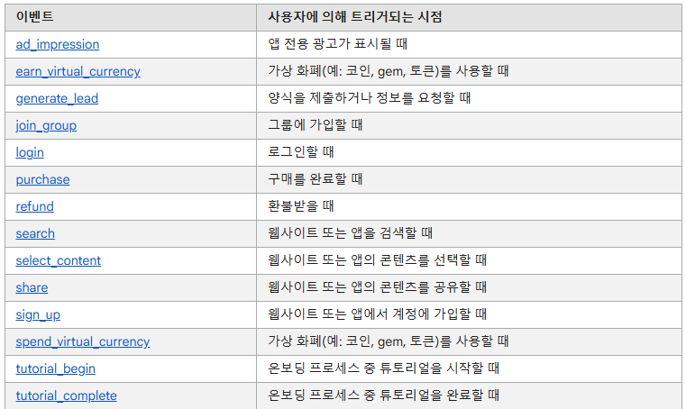
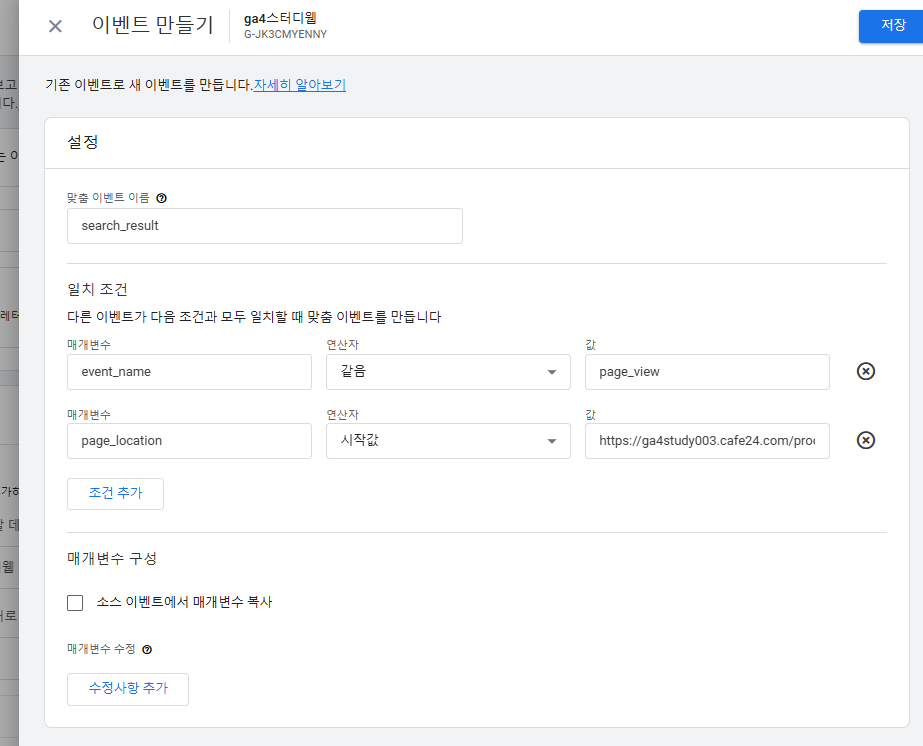

# 이벤트 설계 기획
## 이벤트 설계 문서(정의서)
이벤트를 설계할 때는 다음과 같이 문서를 만들어 정리하고 이벤트를 만드는 것이 좋다

## 이벤트 설계 규칙 by 구글
> 내가 만들려는 이벤트가 구글이 정의한 1,2,3,4 중 어느 카테고리에 속하는지 알고 가이드에 따라야 한다

1. 자동 수집 이벤트 > 그냥 사용

2. 향상된 측정 이벤트 > 그냥 사용(GA4 웹 스트림에서 확인 가능)

3. 추천 이벤트 > 내가 만들어서 사용(가이드에 맞게)
- 추천 이벤트에 이름이 정의되어 있으면 해당 이벤트는 **정의된 이름**으로 사용해야 함
- ex) 로그인 기록 = login
- 가이드 주소 : https://support.google.com/analytics/answer/9267735?hl=ko

4. 맞춤 이벤트 > 내가 만들어서 사용
-  **왠만한 이벤트는 추천 이벤트에 다 있음**
- 머신러닝을 위해서는 추천이벤트를 따르는 게 좋음

## 대표 이벤트 설계 규칙
1. 자동 수집 이벤트 
- session_start : 세션이 시작될 때
- page_view : 페이지가 로드될 때
- screen_view : 화면 전환이 발생하고 다음 기준 중 하나가 충족될 때

2. 향상된 측정 이벤트
- 스크롤
- 이탈 클릭
- 사이트 검색
- 양식 상호작용
- 동영상에 호음
- 파일 다운로드

## 이벤트 만들기 기능
- 관리 > 이벤트 > 이벤트 만들기

- GTM을 사용하지 않고 GA4에서 이벤트를 만들 수 있다

# 이벤트 설계 정리
### 이벤트를 만드는 4가지 방법
1. 이벤트 스니핏을 추가(gtag)
2. GTM으로 셋팅
3. GA4에서 이벤트 만들기
4. GA4 잠재고객 트리거 사용

### 전자상거래 세팅
- 외주 or 개발자 or java공부
