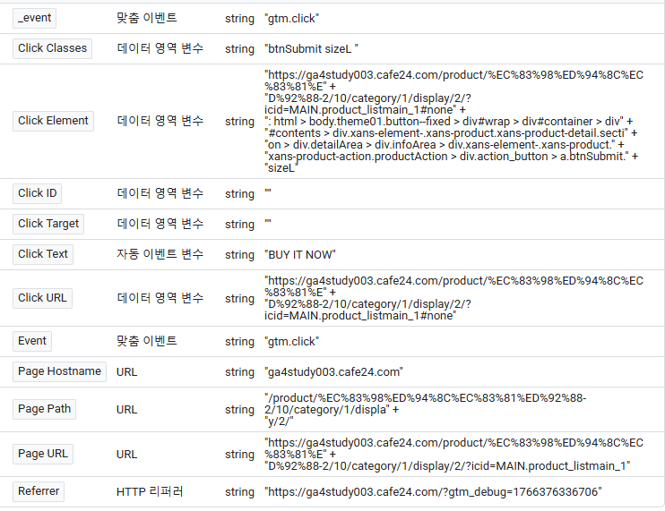

## 이벤트 개요
이벤트 = 사용자의 행동 ex)페이지뷰, 클릭, 스크롤 등

전환 = 이벤트 중 중요한 것 ex)구매,구독

### 보고서 中 참여도
복습 : 참여
- 10초 이상 머뭄
- 2페이지 이상 봄
- 전환이 일어남

활성 사용자당 참여 온라인 세션 수
- 활성 사용자 1명이 참여 기준을 만족한 세션을 평균 몇 번 가졌는지

평균 온라인 세션 참여 시간
- 1번 참여할 때 얼마나 머물렀는지

활성 사용자 = 참여 세션을 1번이라도 만든 사용자

> 활성 사용자당 참여 온라인 세션 수는 1 이하가 될 수 있음  
> ex) 활성 사용자 100명 / 참여 세션 80개  
> ex) 활성은 됬지만 참여를 하지 않음(8초 머뭄 등)

**활성 사용자가 1번 방문에 참여 세션을 만족하고 2,3번 방문에는 참여 세션을 만족하지 못하면 활성 사용자당 참여 온라인 세션 수가 1이하가 됨**

## 태그매니저 GTM 복습
컨테이너 - 보관함  
- 태그 - 데이터를 보낼 곳  
- 트리거 - 방아쇠  
- 변수 - 데이터를 담는 그릇

## 클릭 이벤트 실습
### 이벤트 설계 기획 순서
- 목적 정의 : 왜 이벤트가 필요하지
- 데이터 정의 : 어떤 데이터가 필요하지
- 시점 : 언제 필요하지

### 상황
> 우리 로그인 페이지에서 고객이 어떤 버튼을 많이 누를까?  (로그인, 회원가입)  
> 데이터 =  로그인 페이지 진입 데이터, 로그인 데이터, 회원가입 데이터  
> 각 버튼을 따로따로 수집해야함(로그인, 회원가입)

### 변수 중 클릭 변수들
- Click Classess + 포함

> 주소를 모르겠으면 태그 생성 후 미리보기로 주소를 알 수 있다

- Click Classess = btnSubmit sizeL
- Click Text = BUY IT NOW

- Click Element + CSS 선택 도구와 일치 = 태그관리자 or   
**검색 > 개발자도구 > 좌클릭 > copy > copy selector**

