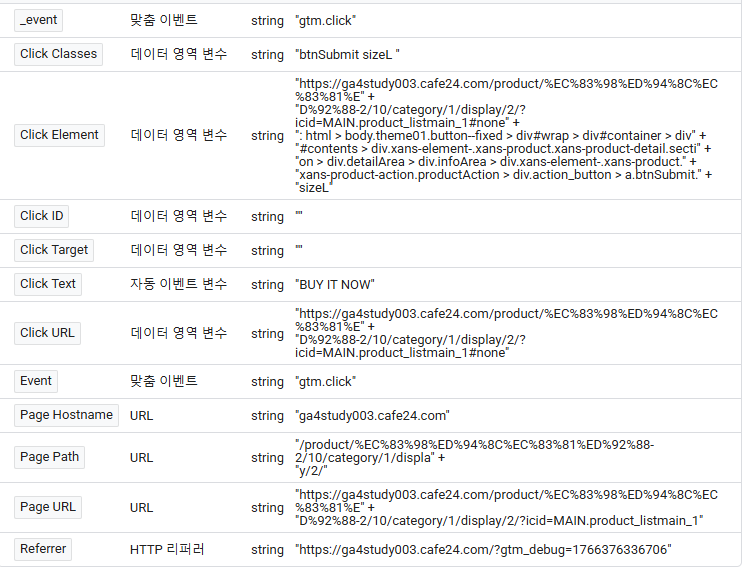

# 클릭 이벤트 복습

## 클릭 이벤트 세팅법
1. 이름(class)을 찾아서 세팅
2. 태그 매니저에서 변수값 등을 찾기 click text = 'BUY IT NOW'

3. Css selector 사용(Click Element + CSS 선택 도구와 일치)

## 이벤트 설계 기획 순서
- 목적 정의 : 왜 이벤트가 필요하지
- 데이터 정의 : 어떤 데이터가 필요하지
- 시점 : 언제 필요하지

## 클릭이벤트 실습
#### 위시리스트 버튼 클릭시 상품명을 가져오기

- 목적 : 추천을 위해
- 데이터 : 클릭, 제품명 데이터
- 시점 : 위시리스트 버튼을 클릭했을 때

### 이벤트 매개변수
이벤트 매개변수 = 내가 정한 변수 이름  
값 = 변수에서 생성  

1. (홈페이지에서)위치값을 copy select로 저장
2. (GTM변수에서) 사용자 정의 변수 사용
3. (GTM변수에서) 구성 中 DOM요소
4. (GTM변수에서) 요소 선택 도구 = 위치값(#contents > div.xans-element-.xans-product.xans-product-detail.section > div.detailArea > div.infoArea > div.headingArea > h1)
5. (GTM태그에서) 값에 사용자 정의 변수 추가

> 사용자 정의 변수는 특정 상품 주소 하나를 저장하는 것이 아니라,
같은 구조를 가진 모든 상품 페이지에서 상품명을 자동으로 가져온다.

> 하나의 페이지 주소에서 DOM 선택자를 따오더라도,
그 선택자가 다른 페이지에서도 동일한 구조로 존재하면 전부 작동한다.

> 같은 구조 = DOM 트리에서 ‘상품명 요소까지 가는 경로(CSS selector)’가 동일한 상태