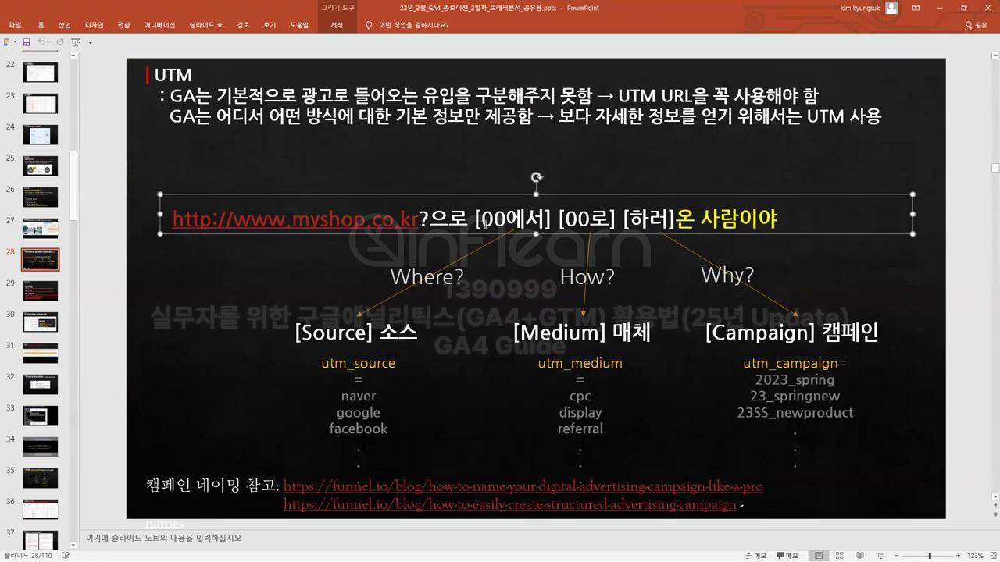
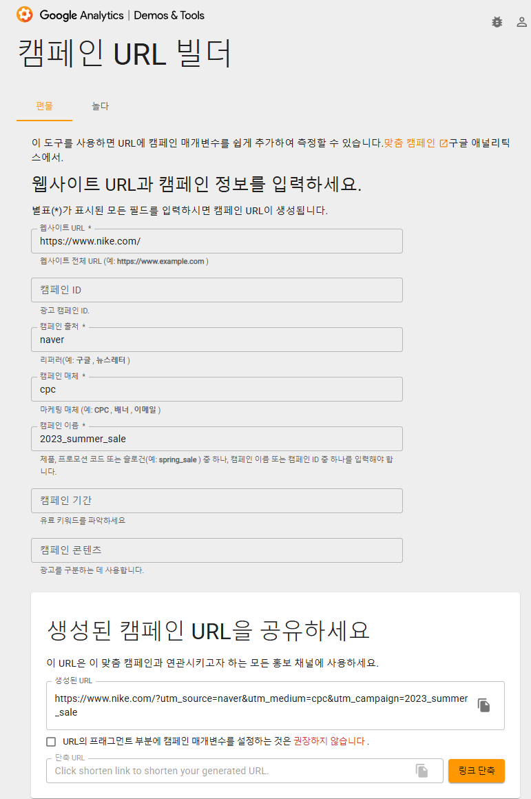

## 요약
- 소스 : 어디서 왔는가 (google, facebook)
- 매체 : 웹사이트에 도달한 방식 (organic, cpc, referral)

### 그 외 세션 기본 채널 그룹 용어 정리
- Paid Shopping = cp로 되어있는 광고를 통한 유입(cpc,ooc)

- Cross-network = 광고중의 기타 묶음

    Paid  
    ├─ Paid Search  
    ├─ Paid Social  
    ├─ Paid vidio = (유튜브 등의 광고)      
    ├─ Paid Other = (기타)  
    └─ Cross-network = (구글 ads전용)

## UTM
- GA4는 스스로 Organic과 Paid를 구분하지 못한다
- 따라서 우리가 리퍼러(referrer)에 직접 구분을 해 줘야 함
- 그것이 UTM URL

> https://www.sooplive.co.kr? + [소스]에서 [매체]로 [캠페인]하러 온 사람이야

### UTM URL주소 읽는 방법

> https://www.nike.com/kr/?  
utm_source=naver    = 소스  
&utm_medium=cpc   = 메체  
&utm_campaign=main_pc&utm_term=maintext&cp=59544783063_search_ = 캠페인

EX) 네이버 에서 광고로 캠페인을 보러 온 사람이야

### UTM URL만드는 법
>by URL BUILDER

-  utm_term은 치환변수이다.   
단, {}를 사용하지만
주소에는 앞뒤에 %숫자가 저절로 붙으니   
url을 제공할 때는 %숫자를 제거하고 공유해야한다

#### 주의사항
- **캠페인 이름은 주로 스프레드시트에 규칙을 만들어두고 사용한다** > 이래야 명칭이 통일되고 관리가 쉬움  
* ex) utm_source = kakao / utm_source = kakaotalk > 이러면 동일한 kakao에서 들어온 거라도 분석이 쉽지 않음

### UTM을 GA4에서 읽기
#### utm_id, utm_source, utm_medium, utm_캠페인
> 보고서 > 획득 > 트래픽 획득(Traffic acquision)

* 위 4개는 탐색에서도 가능

#### utm_term, utm_content
> 탐색 > 측정기준 > 수동 > 세션 수동 검색어(utm_term), 세션 수동 광고 콘텐츠(utm_content)

| UTM 파라미터       | 클릭할 GA4 측정기준     |
| -------------- | ---------------- |
| `utm_id`       | **세션 수동 캠페인 ID** |
| `utm_source`   | **세션 수동 소스**     |
| `utm_medium`   | **세션 수동 매체**     |
| `utm_campaign` | **세션 수동 캠페인 이름** |
| `utm_term` |**세션 수동 검색어**|
| `utm_content` |**세션 수동 광고 콘텐츠**|
