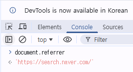
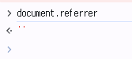
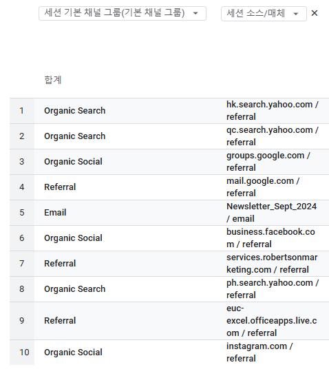

# 트래픽분석
- 사용자가 **어디에서** 오는지

## GA4 유입 경로 정의
- Search = 검색엔진 ex) 네이버, 구글
    - Organic Search = 무료 검색
    - Paid Search = 유료 검색(홈페이지 中 광고)

- Social = SNS ex) 페이스북, 인스타
    - Organic Social = 무료
    - Paid Social = 유료(링크 등 광고)

- Direct = 즐겨찾기/직접타이핑

### 리퍼러
- 리퍼러(referrer) = 주소 : 웹사이트에서 웹사이트로 넘어갈 때는 넘어가는 웹사이트에게 주소를 전달한다  
ex) 네이버 검색엔진 > 나이키 사이트 : 나이키 사이트는 네이버에서 들어왔다는 정보를 알게 됨

    
    > 네이버에서 왔다(Organic Search)

    
    > 즐겨찾기 or 직접타이핑으로 왔다

## GA4 획득에 관한 용어
- 채널 
    - GA4에서 정의해놓은 소소 + 매체

- 소스 
    - 어디서 왔는가?(where)

- 매체 

|소스(where)| 매체(How) |  채널(Group) |
|---|---|---|  
google | cpc | Paid Search
naver | cpc | Paid Search
naver | organic | Organic Search
facebook | display | Display
kakao | display | Display

> referral = 다른 웹사이트에서 링크를 타고온 유입

> referrer = 데이터   
> referral = referrer를 해석해 분류

### 햇갈리는 채널과 매체 정의 요약

- Organic Search  
  : 검색엔진 결과를 통한 무료 유입  
  (medium = organic, referral)

- Paid Search / Paid Social  
  : 광고 클릭으로 유입된 트래픽  
  (medium = cpc, ppc 등)

- Referral  
  : 검색·광고가 아닌 외부 웹페이지의 링크를 통한 유입  
  (medium = referral)

### 그 외 세션 기본 채널 그룹 용어 정리
- Paid Shopping = cp로 되어있는 광고를 통한 유입(cpc,ooc)

- Cross-network = 광고중의 기타 묶음

    Paid  
    ├─ Paid Search  
    ├─ Paid Social  
    └─ Cross-network  

